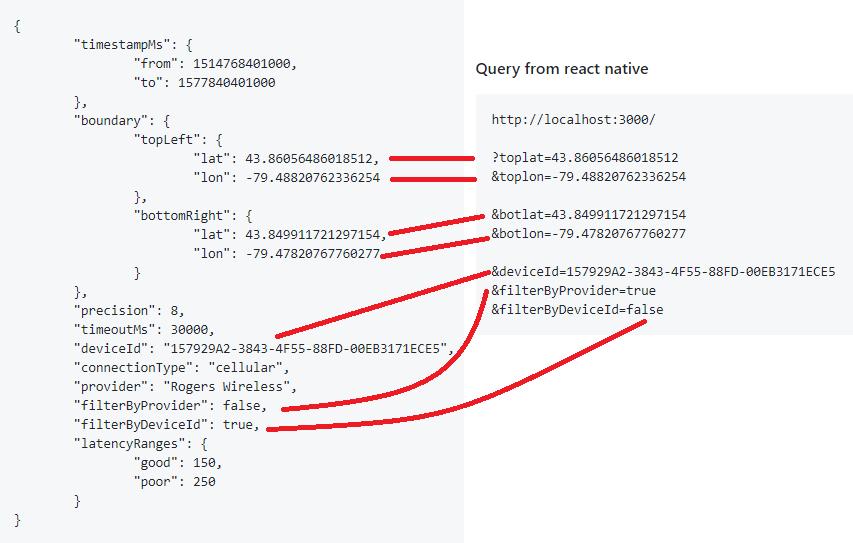

# reactjs-maps-poc

React app

Restfull API(get marker data with LeftTop and RightBottom Lng/Lat from end point) 

GoogleMap API(Map, user Markers, heatmap) 


## Requirements

1. ReactJS SPA web application with the least number of artefacts in the project
1. Responsive and mobile browser friendl
1. Maps is to center on the current user geo location
1. Please note: currently, the data is availalbe in Southern Ontario, Canada only
1. Maps tab is to display geoHash overlay based on geoHash query to the end-point mapping the Avg(***value***) NOT Sum(***count***)
1. User can scroll the map with the overlay information updated automatically
1. User can zoom in and out with increased/decreased precision of the data plotted on the map
1. Map dynamically adjusts the data ploted based on the zoom level and the current map center, e.g.:

1. Developer will address comments and issues reported

## New requirement

1. Instead of circles
1. Use heatmap, where weight is the value returned by the end-point
1. Read initial map coordinates, precision, lat/lon delta from the query string to centre the map
1. Allow zoom-in/out and move of the map, fetch data based on the new map location
1. Formula to calculate the precision:
```
  const minPrecision = 4;
  const maxPrecision = 8;
  const maxLatitudeDelta = 1.5;
  const logBase = 1.91;
  const correctionFactor = 1.4;
  const precision = Math.max(
      minPrecision,
      Math.min(
        ((maxLatitudeDelta - Math.log(latitudeDelta)/Math.log(logBase)) * correctionFactor),
        maxPrecision
      )
    );

```

## Data End-Point

### geoHash Query vs query from react native

